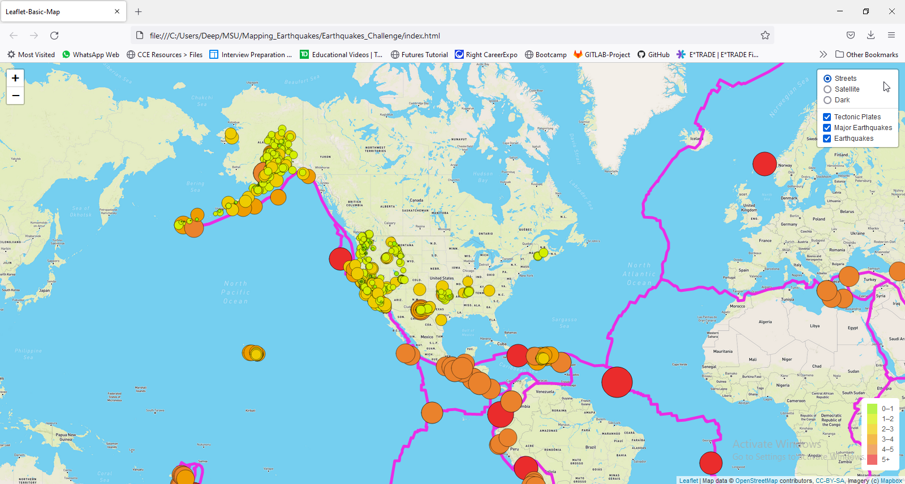
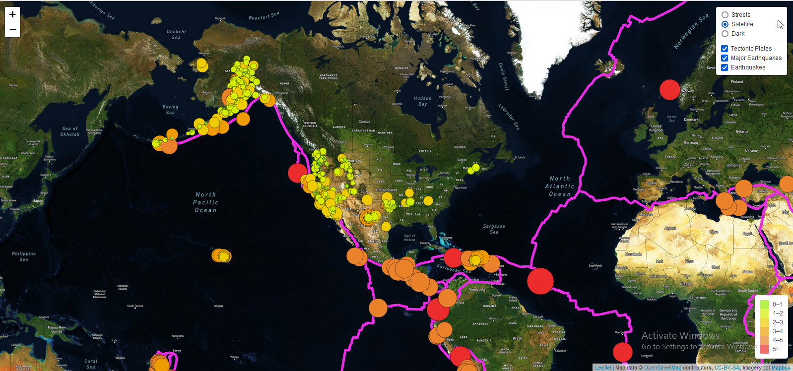
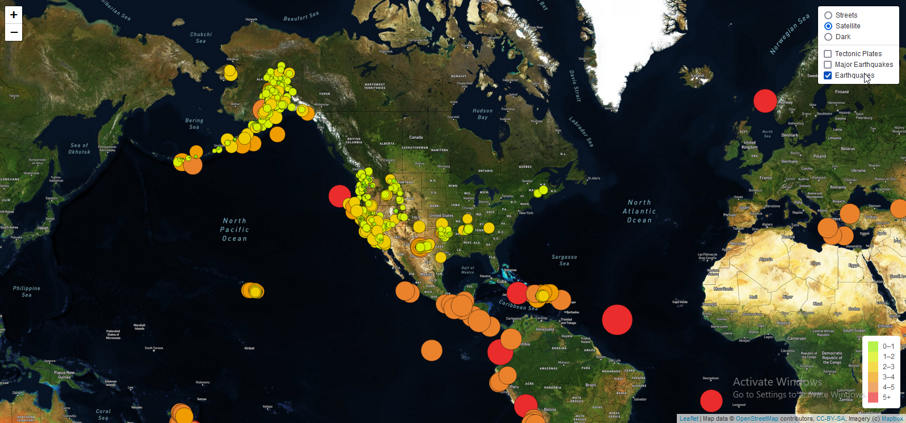
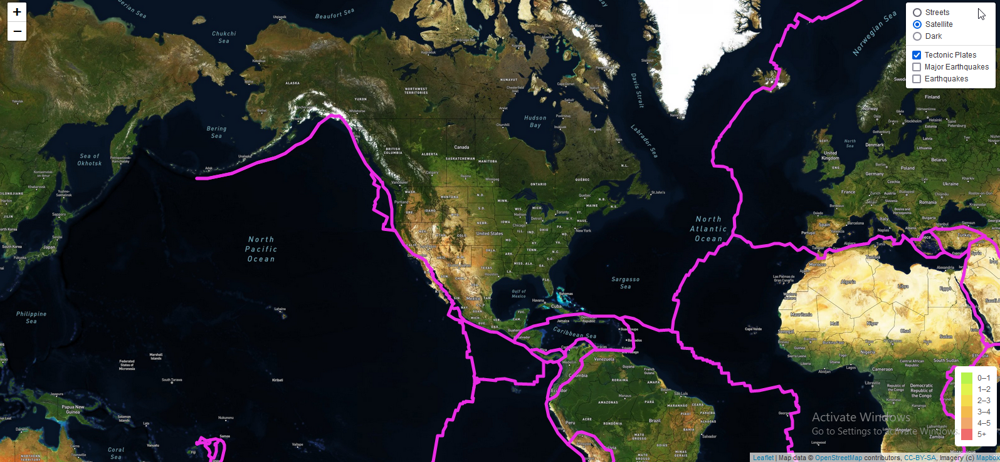
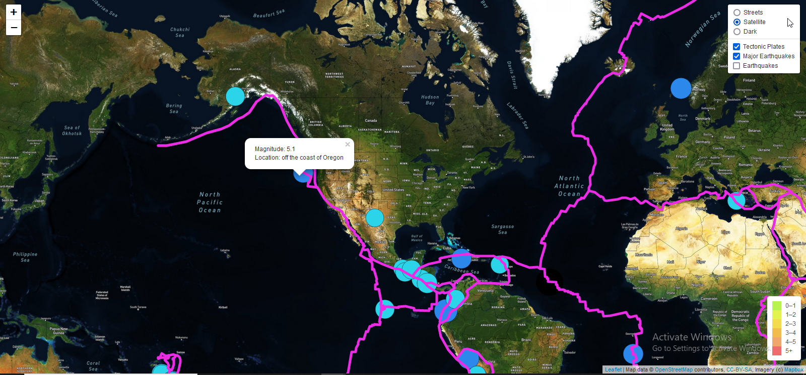
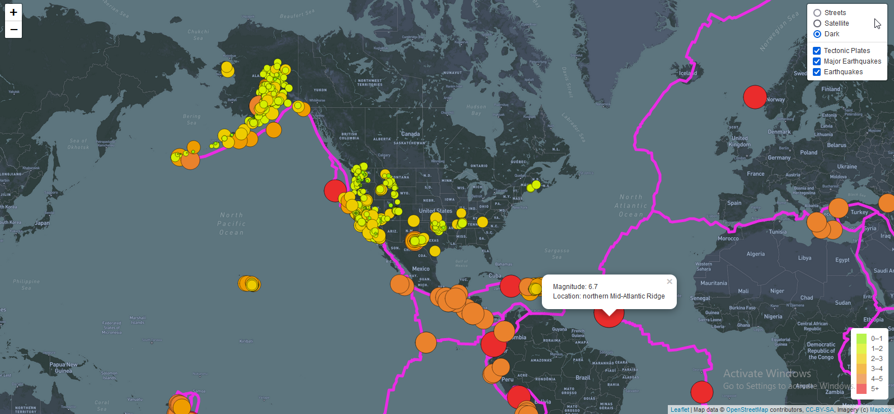

# Earthquakes_Challenge

# Module 13 Challenge-

This written analysis contains two sections:

**1. Overview of Project**

**2. Results**

## 1. Overview of the analysis

The aim of the analysis was to help Basil and Sadhana see the earthquake data in relation to the tectonic plates’ location on the earth. Further, they would like to see all the earthquakes with a magnitude greater than 4.5 on the map, and they would like to see the data on a third map.

The analysis involved Leaflet plots and involveing GeoJSON to pull together the maps
## 2. Results

The results primarily highlights the following outputs,

a: Add Tectonic Plate Data
b: Add Major Earthquake Data
c: Add an Additional Map base layer

### **a. Unfiltered view of the webpage:**

The first step is to understand the layout of the webpage as shown in the image below. The entire unfiltered layers  are shown below,

*a. Unfiltered Webpage with base Streets Layer*

*b. Unfiltered Webpage with base Satellite Layer*

### **b. Filtered overlay with last 7 days Earthquake data:**

*c. Filtered Overlay of last 7 days Earthquakes with base Satellite Layer*

### **c. Filtered Overlay of Tectonic Plates with base Satellite Layer:**

*d. Filtered Overlay of Tectonic Plates with base Satellite Layer*

### **d. Filtered Overlay of Major Earthquakes (>4.5 magnitude) with base Satellite Layer:**

*e. Filtered Overlay of Major Earthquakes (>4.5 magnitude) with base Satellite Layer with Popup:*

### **e. Additional Dark BAse Filter:**

*f. Additional Dark Base Filter with Pop-ups*

